# REMEMBER APPLICATION

Remember is an application that enables Alzheimer patients that have not completely lost their memory to keep track of their day today activies, in this case we help on enabling our patients note down and remember the cities they have been to.

In the same way the application enables them to pinpoint those places they have been to and write down notes about those places, what they did, who they were with and the date and time they were there. In so doing the patients can always look back and be able to memorise these activities to help them with their memory and record moments of their life.
The application is powered by React-Vite. The user interface is crafted using a mixture of HTML, CSS and JavaScript. Furthermore, it is deployed on Heroku, a cloud platform as a service (PaaS).

Its a responsive site as illustrated below.

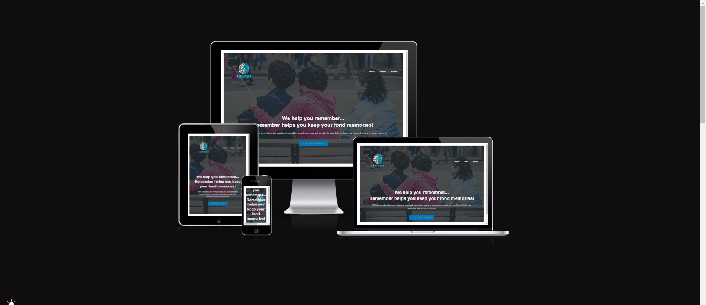

# User stories

Features in this project were structured based on the
[user stories](https://github.com/users/Allano256/projects/7/views/1)

<ul>
<li><strong>Description Of Service:</strong> This field t describes the specific service, feature, or screen that the user story relates to.</li>
<li><strong>User Objective:</strong> This field outlines the user's goal or objective. It should clearly state what the user wants to achieve or accomplish. The format follows: "As a user, I want to [action], so that [reason or benefit]." With this Objective in mind..</li>
<li><strong>Acceptance Criteria:</strong> This field specifies the conditions or criteria that must be met for the user story to be considered complete. It helps define the boundaries and expectations for implementing the user story.</li>
</ul>

# Features

<ul> 
 <ol> <strong> Navigation Bar</strong> </ol>
 <li>The navigation bar has features like logo,About signup, log in,  </li>
 <li>These different features enable the user to register their details as customers, be able to log in as registered users and make start on their journey to record their activities. They can also always come back and retrieve their activities over time but we intentionally didnt allow an edit functionality as this would not make sense to a patient that forgets things in a second to come back after an hour, day or two to try and edit something.</li>
</ul>

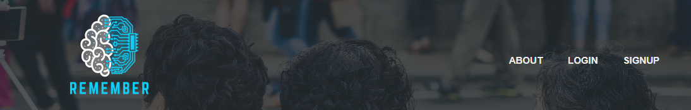

<ul> 
<ol> <strong>The landing page</strong> </ol>
<li>The landing page has an image of three supposedly friends holding hands and enjoying an evening displaying attachment to one anaother.</li>
<li>In the fore front we just have wordings welcoming you to the application.  </li>
</ul>

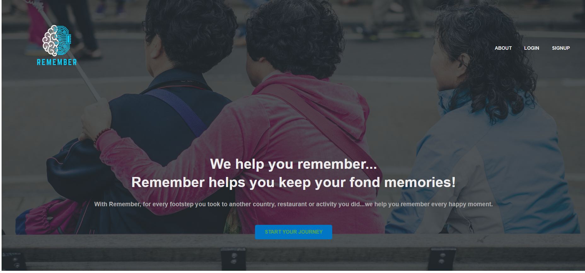

<ul> 
<ol> <strong>The Footer</strong> </ol>
<li>The footer is only visible and accessed by logged in users, its a simple footer</li>

</ul>

<ul> 
<ol> <strong>Create City</strong></ol>
<li>As a logged in user, if you have not visited yet any cities...you will be prompted to click on the map to get started using geolocation to place also a popup to that position. Then a form will be created which is autofilled with the date and city name and all you have to do is add the notes.</li>
</ul>

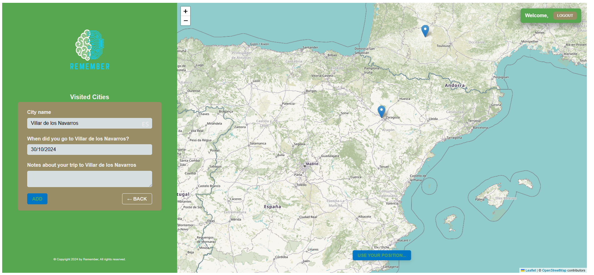

<ul> 
<ol> <strong>List of cities</strong></ol>
<li>
The logged in user can always come back and retrieve a list of all the cities they have noted down in their account, and also get a single city aswell to dive deeper and read the notes attached to the city.</li>

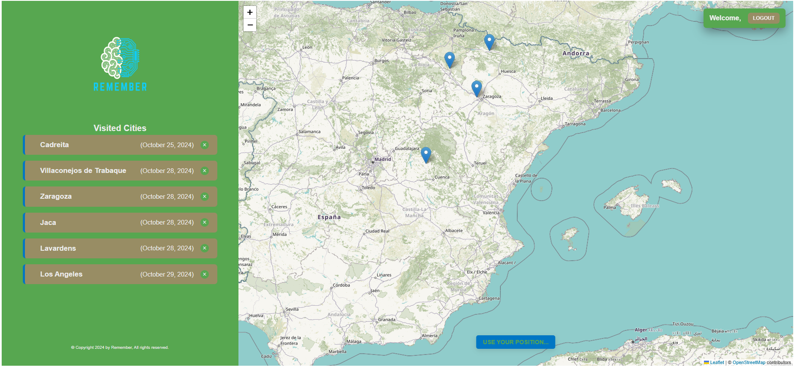

<li>A logged in user also has the ablility to edit notes or date regarding their activity aswell. <li>
</ul>

<ul>
<ol><strong>Signup</strong></ol>
<li> The  signup page allows the user to fillout a form with their details that are saved on the remember database.</li>
<li>As a signedup user, they can have access to their Remember application and can access all the features on it. </li>
</ul>

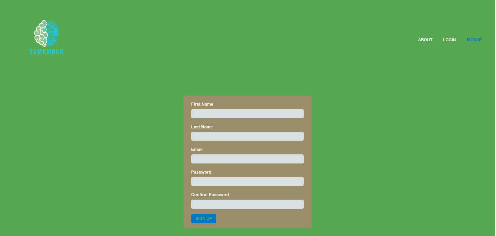

<ul>
<ol><strong>Sign in</strong></ol>
<li>This page will allow the user to log in after registering their credentials. </li>
</ul>

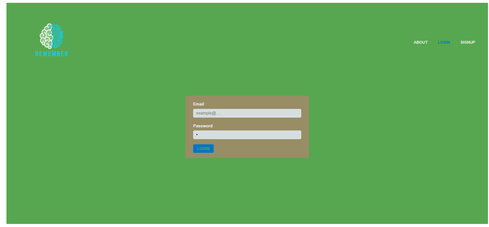

<ul>
<ol><strong>Log Out</strong></ol>
<li>The log out button enables the user to exit the application and be redirected to the landing or start page.</li>
</ul>

<ul>
<ol> <strong>Features not implemented</strong> </ol>

<li>The ability for a user to delete their account.</li>
<li>The ability for a user to reset their password incase they forgot it.</li>
<li>The ability for a user to add pictures of themselves inaddition to the notes, this would strongly better their memory but this is a feature we didnt implement due to time constraints.</li>

</ul>

<ul>
<ol><strong>Testing</strong></ol>
<li>HTML, W3C was used to validate the project for any errors. The project did not have any errors and was successfull.
The site tested HTML and CSS for the application.</li>

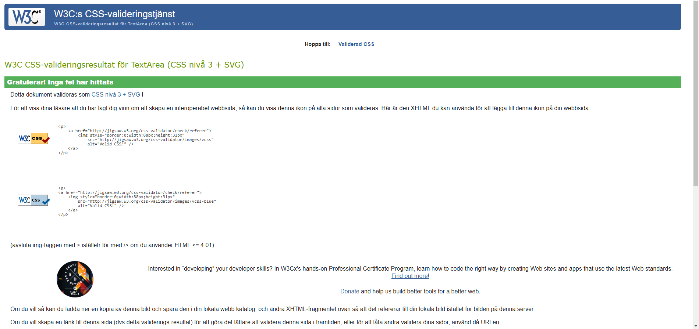

[W3Validator](https://validator.w3.org/)

<li>Javascript, JS Hint was used to validate the javascript for any errors. The project did not have any errors an was successful.
Code from the javascript file was copied and pasted into the JS Hint application for tesing which didnt produce any errors, only warnings as seen in the image below.</li>

[jshint](https://jshint.com/)

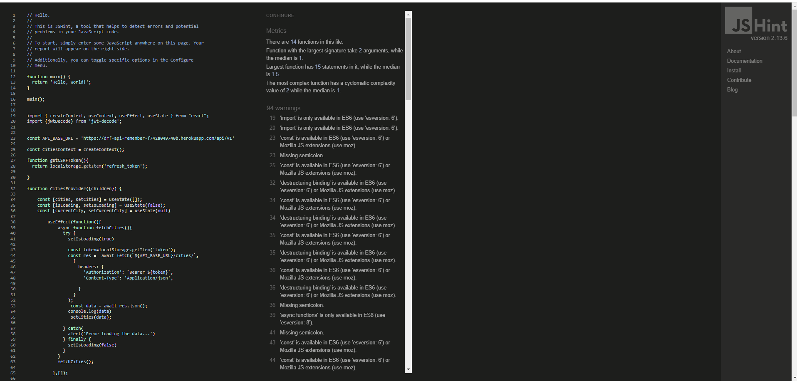

<li>Manual testing was done on the different parts of the software to ensure that it works as it should</li>
<li>Manual testing was done on both the signin and signup forms to ensure that all fields must be filledout before submission. Errors are visually shown to the user to indicate such fields and errors.</li>

<li>The log in form was also tested to ensure that only signedup users can log into the application. This is indicated by the message provided to the user incase wrong details are entered during the login process.</li>

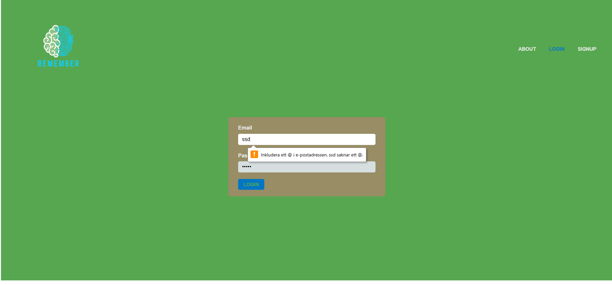

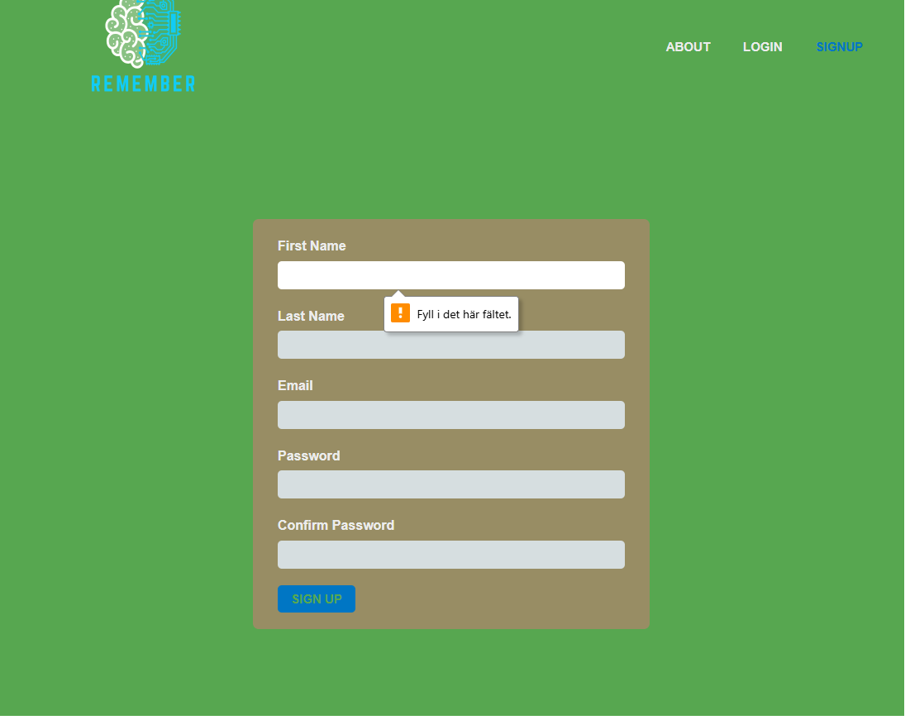

The live link can be found here;

[Remember](https://allano256.github.io/Remember/)

</ul>

The project was deployed on the GitHub hosting platform and below are the steps taken to achieve the feat.

<ul>
<ol><strong>Deployment</strong></ol>
<li>Log into your account in github</li>
<li>Go to the repository of Remember
</li>
<li>Click on the code button,and copy your preffered clone link. </li>
<li>Open the terminal in your code editor and change the current working directory to the location you want to use for the cloned directory.</li>
<li>Use git clone into the terminal, paste the link you copied in step 3 and press enter.</li>

<ul>
<ol> Deployment using Heroku</ol>
<li>Register for an account on Heroku or sign in.</li>
<li>Create a new app.</li>
<li>Give your app a name.</li>
<li>Connect your github repository to Heroku app.</li>
<li>Create a Live Database by adding the postgreSQL add-on.</li>
<li>Create a Cloudfare Account and set up a R2 Bucket.</li>
<li>Create and Set up an email account for verification mails.</li>
<li>Set Config Vars for your cloudfare bucket (AWS_S3_SECRET_ACCESS_KEY), database (DATABASE_URL) and email(EMAIL_HOST_PASSWORD).</li>
<li>Deploy from "deploy", or choose an automatic deploy option.</li>

</ul>
The deployed version can be found via this link on Heroku,

[Remember](https://remember-9895023cd960.herokuapp.com/)

</ul>

<ul>
<ol><strong>Bugs during development.</strong></ol>
<li>Endless loop, which was always a case when we tried to retrieve a single city...and it was a useEffect area we had to figure out by only having one dependancy 'id' and not both 'id','getCity'</li>
<li>Configuring the geolocation to have the popup always move to that point on the map and be visible.</li>
<li>Authentication, 'authentication credentials not provided' this was an error that was preventing creation of a city as the tokens were not being passed well from the backend but also had erros with just simple typo errors instead of 'bearer' we had 'Token' and double checking the typo errors and configuring our backend the issue was resolved.</li>

</ul>

<ul>
<ol><strong>Content</strong></ol>

<li> The images on the hero section were taken from pexels</li>

[pexels](https://pexels.com/sv-se/)

<li>The icons used in the footer were taken from Font awesome.</li>

[font awesome](https://fontawesome.com)

<li> The font used was 'Roboto'.</li>

</ul>

## Colors used

We used color green for the About and most parts of the application (#57A75), to highlight each city we used the (#988D64) color and the buttons a mixture of (#OOBCD4) and (#DFD225)

#### Early deployment.

It was important for me to do early deployment as i was able to see the output,shared the link with other friends to test on their devices and was able to solve the issue.

## Technologies used

<ul>
<li>GitHub, this was used for storage and deployment</li>
<li>VS CODE, Editor</li>
<li>Heroku - Deployment</li>
</ul>

## Feedback

If you have any feedback, please reach out to us at allanzizinga@yahoo.com
